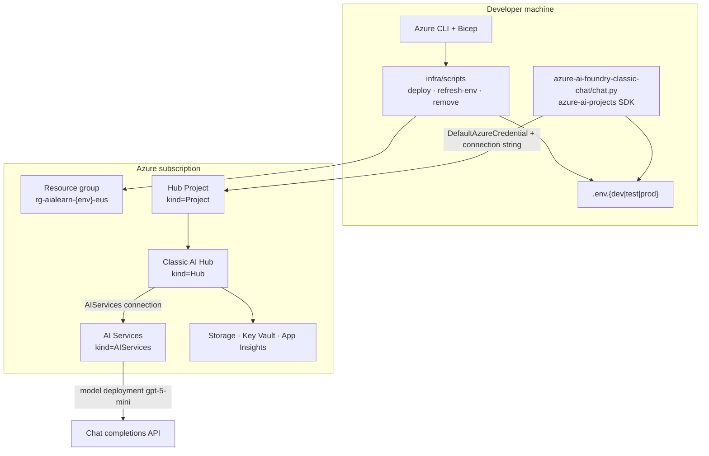
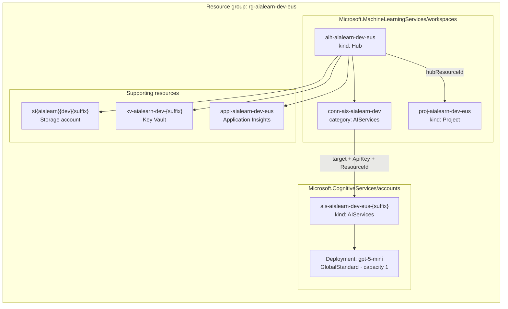
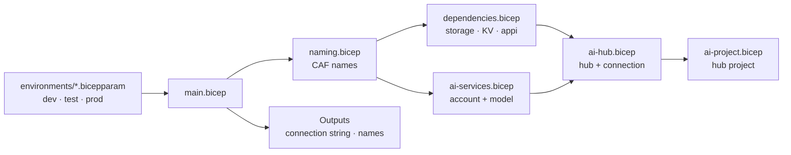
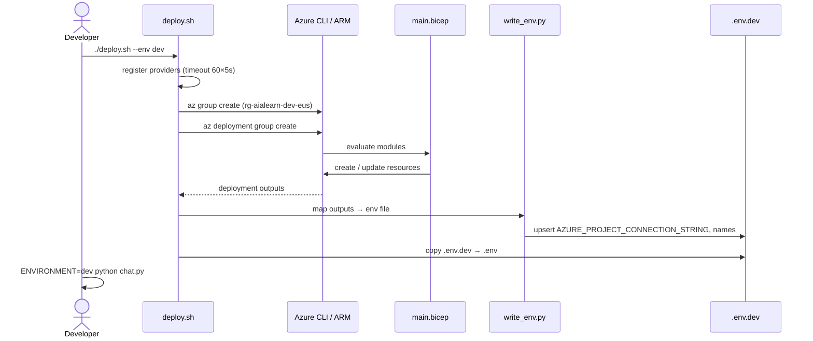
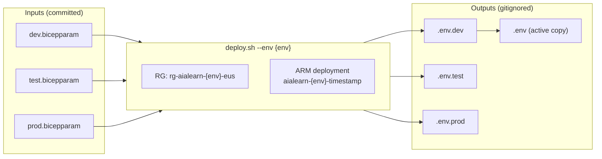
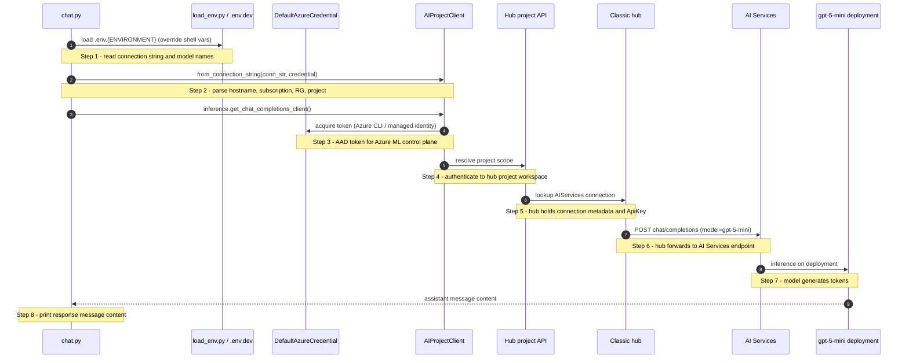
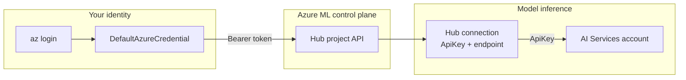
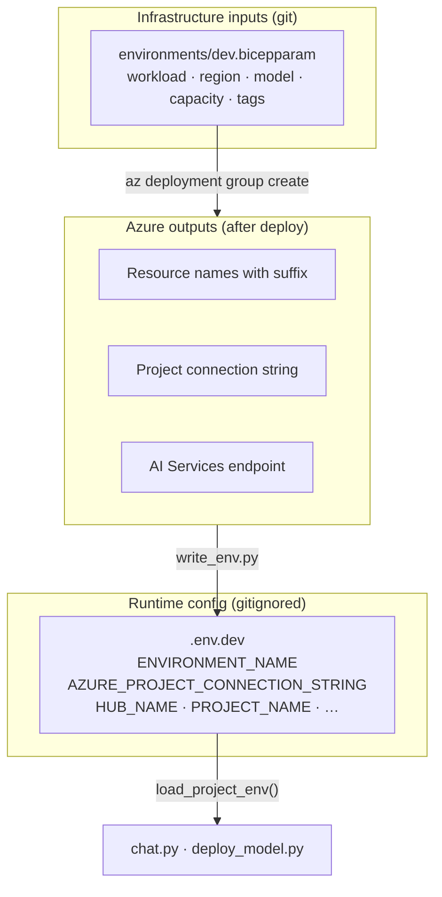
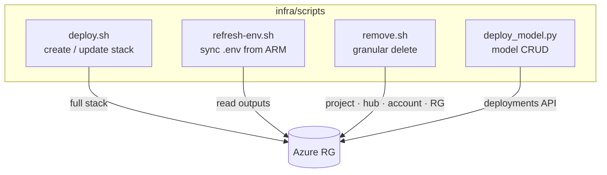
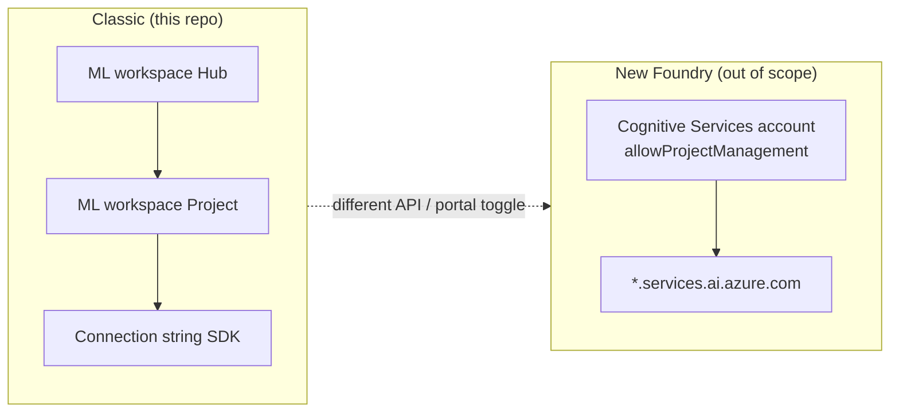

# Architecture — azure-ai-foundry-classic-chat

This document describes the **classic Foundry hub** stack in `azure-ai-foundry-classic-chat`: how Azure resources relate to each other, how Bicep and scripts deploy them, and how the Python app calls the model at runtime.

> **Scope:** `Microsoft.MachineLearningServices/workspaces` with `kind=Hub` / `kind=Project` on [ai.azure.com](https://ai.azure.com) with **New Foundry OFF**.  
> This is **not** the newer unified Foundry resource (`*.services.ai.azure.com`).

---

## 1. System context



| Layer | Technology | Role |
|-------|------------|------|
| **IaC** | Bicep (`azure-ai-foundry-classic-chat/infra/bicep`) | Declarative Azure resources |
| **Deploy glue** | Bash + Python scripts | RG creation, `az deployment`, write env files |
| **Runtime config** | `.env.{environment}` | Connection string, resource names, model name |
| **Application** | `azure-ai-projects==1.0.0b10` | Classic hub SDK chat client |

---

## 2. Azure resource topology

All Lesson 1 resources live in **one resource group per environment** (e.g. `rg-aialearn-dev-eus`).



### Resource relationships

| Resource | ARM type | Purpose |
|----------|----------|---------|
| AI Services account | `Microsoft.CognitiveServices/accounts` | Hosts model deployment; must be `kind=AIServices` |
| Model deployment | `.../accounts/deployments` | Runnable endpoint (`gpt-5-mini`) |
| Classic hub | `Microsoft.MachineLearningServices/workspaces` (`Hub`) | Shared control plane; holds connections |
| Hub connection | `.../workspaces/connections` | Links hub to AI Services for inference |
| Hub project | `.../workspaces` (`Project`) | Scope for SDK; yields connection string |
| Storage / Key Vault | Standard Azure | Hub dependencies (required for classic hub) |
| Application Insights | `Microsoft.Insights/components` | Optional telemetry attachment |

---

## 3. Bicep module graph

Orchestration is in `main.bicep`. Modules deploy in dependency order:



### Module responsibilities

| Module | Creates | Key outputs |
|--------|---------|-------------|
| `naming.bicep` | — (pure naming) | `aiServicesName`, `hubName`, `projectName`, … |
| `dependencies.bicep` | Storage, Key Vault, App Insights | Resource IDs for hub |
| `ai-services.bicep` | AIServices account + optional deployment | `id`, `endpoint`, `deploymentName` |
| `ai-hub.bicep` | Hub workspace + AIServices connection | `id`, `connectionName` |
| `ai-project.bicep` | Project workspace | `name`, `discoveryUrl` |

Connection string is composed in `main.bicep`:

```text
{location}.api.azureml.ms;{subscriptionId};{resourceGroup};{projectName}
```

---

## 4. Deploy pipeline



### Environment selection



| Environment | Param file | Default RG | Local config |
|-------------|------------|------------|--------------|
| `dev` | `environments/dev.bicepparam` | `rg-aialearn-dev-eus` | `.env.dev` |
| `test` | `environments/test.bicepparam` | `rg-aialearn-test-eus` | `.env.test` |
| `prod` | `environments/prod.bicepparam` | `rg-aialearn-prod-eus` | `.env.prod` |

---

## 5. Runtime request flow (chat.py)

When you run `ENVIRONMENT=dev python chat.py`, a single chat request crosses local config, Azure ML project APIs, the classic hub, and the AI Services model deployment. Typical latency is **15–30 seconds** with no streaming.



### Step-by-step (maps to diagram & code)

| Step | What happens | Where | Key config |
|------|----------------|-------|------------|
| **1** | Load runtime config for the active environment. `load_project_env()` reads `.env.dev` (or `.env.{ENVIRONMENT}`), with `override=True` so stale shell exports from a legacy `.env` do not win. | `load_env.py` → `chat.py` L10 | `ENVIRONMENT=dev` |
| **2** | Validate `AZURE_PROJECT_CONNECTION_STRING` and print status lines (`Using environment`, `Project`, `Calling model…`). | `chat.py` L15–28 | `AZURE_PROJECT_CONNECTION_STRING` |
| **3** | Create `AIProjectClient.from_connection_string(...)`. The connection string encodes `{region}.api.azureml.ms;{subscriptionId};{resourceGroup};{projectName}` — the SDK uses it to locate the hub **project** workspace. | `chat.py` L30–33 | e.g. `eastus.api.azureml.ms;…;rg-aialearn-dev-eus;proj-aialearn-dev-eus` |
| **4** | `DefaultAzureCredential()` obtains an Azure AD token (locally: from `az login`). This authenticates **you** to the Azure ML / Foundry control plane — not to the model directly. | `azure-identity` | `az account show` must match deploy subscription |
| **5** | `project.inference.get_chat_completions_client(connection_name=…)` asks the **project** API to resolve the hub’s shared **AIServices** connection. If `AI_SERVICES_CONNECTION_NAME` is set, that connection is used; otherwise the SDK picks the default `AZURE_AI_SERVICES` connection. | `chat.py` L35–39 | `AI_SERVICES_CONNECTION_NAME=conn-ais-aialearn-dev` |
| **6** | The SDK (via hub metadata) calls the AI Services account endpoint with the **ApiKey** stored on the hub connection (created by Bicep). Your user token is not sent to the model endpoint. | Hub → `ais-aialearn-dev-eus-{suffix}` | Connection category must be `AIServices` |
| **7** | `chat.complete(model=DEPLOYMENT_NAME, messages=[…])` sends the system + user messages to the **`gpt-5-mini`** deployment on the AI Services account. The model runs inference and returns completion tokens. | `chat.py` L40–55 | `DEPLOYMENT_NAME=gpt-5-mini` |
| **8** | Response is printed to stdout: `response.choices[0].message.content`. No conversation history is kept — each run is a single request/response. | `chat.py` L57 | — |

### Connection string anatomy

The string in `.env.dev` has four semicolon-separated parts:

```text
eastus.api.azureml.ms ; <subscription-id> ; rg-aialearn-dev-eus ; proj-aialearn-dev-eus
        │                        │                    │                      │
   ML API hostname          subscription          resource group        project name
```

The SDK uses this to scope all project-level API calls. It does **not** contain the AI Services API key — that lives on the hub connection in Azure.

### Two auth paths (why both exist)



| Path | Credential | Used for |
|------|------------|----------|
| **User → Project** | Azure AD (`DefaultAzureCredential`) | Resolving project, listing connections, SDK control-plane calls |
| **Hub → AI Services** | ApiKey on hub connection | Actual `chat.completions` call to `gpt-5-mini` |

### Authentication model

| Step | Mechanism |
|------|-----------|
| SDK → Azure ML project | `DefaultAzureCredential` (local: Azure CLI login) |
| Hub → AI Services | **ApiKey** stored on hub connection (created by Bicep via `listKeys`) |
| Local config | Connection string identifies project; no API key in `.env` for SDK auth |

### Common failure points

| Symptom | Likely step | Fix |
|---------|-------------|-----|
| `AZURE_PROJECT_CONNECTION_STRING is not set` | 1 | Run `./deploy.sh --env dev` or `refresh-env.sh` |
| `ResourceGroupNotFound` for `my-foundry-rg` | 1 | Stale shell vars — use `ENVIRONMENT=dev` and ensure `.env.dev` exists; `load_env` uses `override=True` |
| `No connection of type AZURE_AI_SERVICES` | 5 | Redeploy Bicep; account must be `kind=AIServices` |
| Long pause after “Calling model…” | 6–7 | Normal (~15–30s); not a hang |
| `DeploymentNotFound` | 7 | Check `DEPLOYMENT_NAME` matches Bicep deployment (`gpt-5-mini`) |

---

## 6. Configuration flow

Two config layers — **inputs** vs **outputs**:



**Rule:** Change infra shape in `.bicepparam` → redeploy. Don't hand-edit generated names in `.env`. Use `refresh-env.sh` to re-sync without redeploying.

---

## 7. Day-2 operations



| Script | When to use |
|--------|-------------|
| `deploy.sh` | Initial create, param changes, model version bump via Bicep |
| `refresh-env.sh` | Connection string or names out of sync; `--live-connection` for discovery URL |
| `remove.sh` | Tear down project, hub, account, or entire RG |
| `deploy_model.py` | Add/update/delete deployments without full Bicep redeploy |

---

## 8. Naming (CAF)

Generated by `naming.bicep` from `workloadName`, `environmentName`, `regionShortName`, `uniqueSuffix`:

| Abbrev | Resource | Pattern | Example (dev) |
|--------|----------|---------|---------------|
| `rg` | Resource group | `rg-{wl}-{env}-{reg}` | `rg-aialearn-dev-eus` |
| `ais` | AI Services | `ais-{wl}-{env}-{reg}-{suf}` | `ais-aialearn-dev-eus-x7k2q` |
| `aih` | Hub | `aih-{wl}-{env}-{reg}` | `aih-aialearn-dev-eus` |
| `proj` | Project | `proj-{wl}-{env}-{reg}` | `proj-aialearn-dev-eus` |
| `st` | Storage | `st{wl}{env}{suf}` | `staialearndevx7k2q` |
| `kv` | Key Vault | `kv-{wl}-{env}-{suf}` | `kv-aialearn-dev-x7k2q` |
| `conn-ais` | Hub connection | `conn-ais-{wl}-{env}` | `conn-ais-aialearn-dev` |

`uniqueSuffix` defaults to `take(uniqueString(resourceGroup().id), 5)` — pin it in `prod.bicepparam` for stable names across redeploys.

---

## 9. Repository layout

```text
azure-ai-accelerator/
├── .env.example             ← template
├── .env.{dev|test|prod}     ← generated (gitignored)
└── azure-ai-foundry-classic-chat/
    ├── architecture.md      ← this file
    ├── chat.py              ← runtime app
    ├── readme.md
    ├── requirements.txt
    ├── infra/
    │   ├── bicep/           ← Azure resources
    │   └── scripts/         ← deploy & day-2 ops
    └── infra_legacy/        ← superseded shell scripts (reference)
```

---

## 10. Design decisions & constraints

| Decision | Rationale |
|----------|-----------|
| **AIServices** account kind | Classic `get_chat_completions_client()` requires `AZURE_AI_SERVICES` connection type |
| **Hub + project** (not new Foundry) | Matches Microsoft classic quickstart and `azure-ai-projects==1.0.0b10` |
| **Bicep over shell** | Repeatable, reviewable, environment-parametrized infra |
| **Per-env `.env` files** | Isolates dev/test/prod config; `ENVIRONMENT` selects active file |
| **Public network access** | Learning / free-trial friendly; tighten for real prod (private endpoints, RBAC) |
| **ApiKey on hub connection** | Simplest path for Lesson 1; production may prefer managed identity patterns |

### Classic vs new Foundry



---

## 11. Related docs

- [readme.md](readme.md) — hands-on walkthrough
- [infra/README.md](infra/README.md) — deploy, day-2 ops, cleanup
- [Microsoft classic hub quickstart](https://learn.microsoft.com/en-us/azure/foundry-classic/quickstarts/hub-get-started-code)
