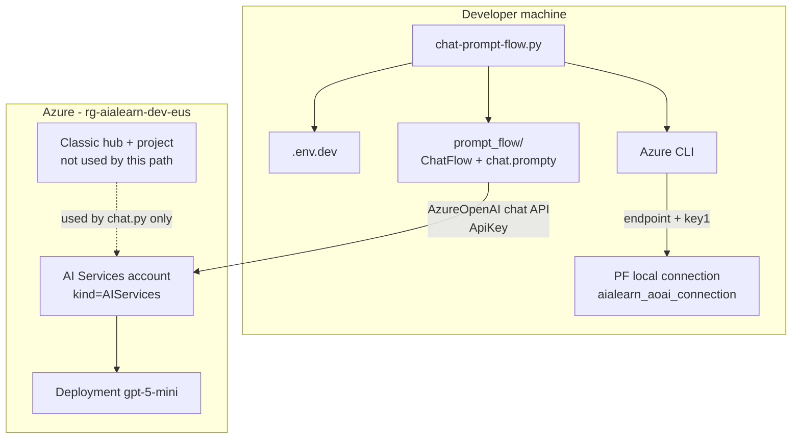
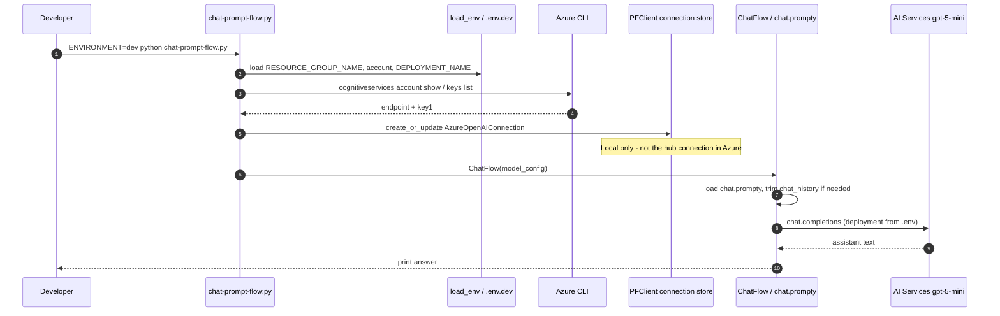
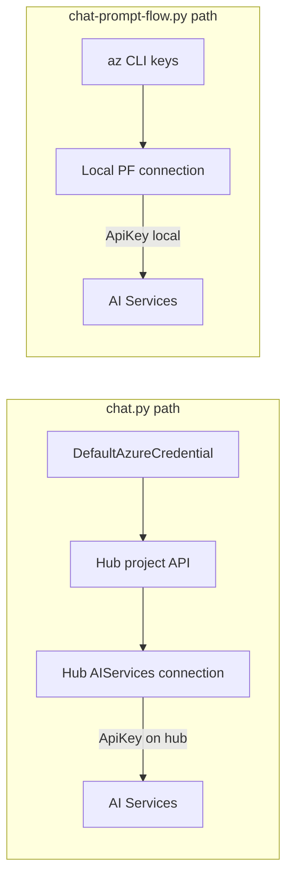

# prompt_flow — classic chat flex flow

Local [Prompt Flow](https://microsoft.github.io/promptflow/) **flex flow** used by [`../chat-prompt-flow.py`](../chat-prompt-flow.py).

> **Retirement:** Prompt Flow in Microsoft Foundry (classic) and Azure Machine Learning retires **April 20, 2027** and is not recommended for new development. Prefer [Foundry Agents / Agent Framework](https://learn.microsoft.com/en-us/azure/foundry-classic/concepts/prompt-flow). This folder is an educational sample on the classic hub stack only.

## Layout

| File | Role |
|------|------|
| `flow.flex.yaml` | Flex flow entry (`flow:ChatFlow`) + sample inputs |
| `flow.py` | `ChatFlow` class — loads prompty, trims history for token limit |
| `chat.prompty` | System/user prompt template (`gpt-5-mini`, `max_completion_tokens`) |
| `requirements.txt` | Flow-local deps (`promptflow`) |
| `__init__.py` | Makes `prompt_flow` importable |

## Architecture — how it works

This sample does **not** go through the classic hub project connection string (unlike `chat.py`). It talks **directly** to the AI Services account that Bicep deployed, using a **local** Prompt Flow connection created from Azure CLI keys.

### System context



### Request sequence



### Step-by-step

| Step | What happens | Code / config |
|------|----------------|---------------|
| **1** | Load environment file for `ENVIRONMENT` (default `dev`). | `load_project_env()` → `.env.dev` |
| **2** | Read RG + AI Services account name (written by Bicep deploy). | `RESOURCE_GROUP_NAME`, `COG_SERVICES_ACCOUNT_NAME` |
| **3** | Use `az` to fetch the account **endpoint** and **key1** (not stored in git). | `ensure_promptflow_connection()` |
| **4** | Upsert a local Prompt Flow connection named `aialearn_aoai_connection`. | `PFClient().connections.create_or_update(...)` |
| **5** | Build `AzureOpenAIModelConfiguration` pointing at that connection + `DEPLOYMENT_NAME`. | `chat-prompt-flow.py` |
| **6** | Instantiate `ChatFlow`, load `chat.prompty`, optionally trim `chat_history` for token budget. | `flow.py` |
| **7** | Render the prompty (system persona + history + user question) and call Azure chat completions. | `chat.prompty` → AI Services |
| **8** | Print the string answer to stdout. | runner |

### Auth paths (why this differs from `chat.py`)



| Path | Credential to control plane | Credential to model |
|------|----------------------------|---------------------|
| `chat.py` | Azure AD (`DefaultAzureCredential`) to hub project | ApiKey stored on **hub** connection |
| This flow | Azure CLI (to read keys) | ApiKey stored in **local** Prompt Flow connection |

Same Azure model deployment either way — different orchestration and auth plumbing.

### Data flow inside the flex flow

```text
question (+ chat_history)
        │
        ▼
┌───────────────────┐
│ chat.prompty      │  system persona + history turns + user question
└─────────┬─────────┘
          │
          ▼
┌───────────────────┐
│ ChatFlow          │  estimate tokens → trim oldest history if over limit
└─────────┬─────────┘
          │
          ▼
┌───────────────────┐
│ AI Services       │  deployment = DEPLOYMENT_NAME (e.g. gpt-5-mini)
│ chat.completions  │
└─────────┬─────────┘
          │
          ▼
       answer (str)
```

Connection is **local** to the Prompt Flow client (not the hub connection in Azure). API keys are fetched via Azure CLI and are not stored in git.

## Prerequisites

1. Bicep stack deployed (`./infra/scripts/deploy.sh --env dev`)
2. Packages installed:

```bash
# from repo root
pip install -r azure-ai-foundry-classic-chat/requirements.txt
```

3. `az login` with access to the AI Services account in `.env.dev`

## Run

From the module directory (`azure-ai-foundry-classic-chat/`):

```bash
ENVIRONMENT=dev ../.venv/bin/python chat-prompt-flow.py

PROMPT_FLOW_QUESTION="What is a classic Foundry hub?" \
  ENVIRONMENT=dev ../.venv/bin/python chat-prompt-flow.py
```

Prefer an explicit `PROMPT_FLOW_QUESTION` — some models return noisy text on the default tax sample prompt.

## Customize

| Change | Where |
|--------|--------|
| System persona / prompt | `chat.prompty` |
| Default deployment name | `flow.flex.yaml` sample + `DEPLOYMENT_NAME` in `.env` |
| Max history tokens | `ChatFlow(max_total_token=…)` in `flow.py` / runner |
| Connection name | `CONN_NAME` in `../chat-prompt-flow.py` (must match `flow.flex.yaml`) |

## vs `chat.py`

| | `chat.py` | This flow |
|---|-----------|-----------|
| Path | Hub project SDK → AIServices connection | Direct AI Services endpoint via PF connection |
| Orchestration | Single `chat.complete` | Prompty + optional chat history trimming |
| Best for | Classic hub SDK lesson | Seeing Prompt Flow flex/prompty patterns |

## References

- [Prompt flow in Foundry (classic)](https://learn.microsoft.com/en-us/azure/foundry-classic/concepts/prompt-flow)
- [Chat with class-based flex flow](https://microsoft.github.io/promptflow/tutorials/chat-with-class-based-flow.html)
- Module walkthrough: [../readme.md](../readme.md)
